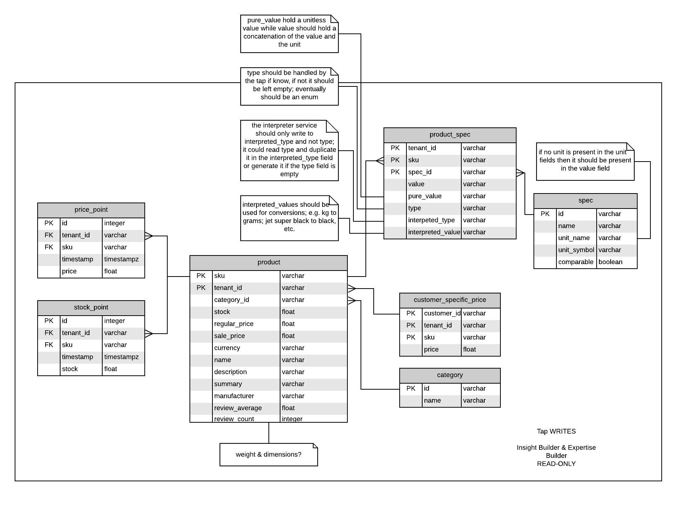

## tap-occ-products

This is a [Singer](https://singer.io) tap that produces JSON-formatted data
following the [Singer
spec](https://github.com/singer-io/getting-started/blob/master/SPEC.md).

This tap:

- Pulls raw data from any SAP Commerce Suite instance.
- Extracts the following product resources [ detailed data model [below](#product-data-model) ]:
  - descriptions
  - prices
  - stock status
  - categories
  - features

<br>

### Adding the tap to Meltano

__Important__: if you haven't installed meltano on your machine yet, follow this [tutorial](https://meltano.com/developer-tools/self-hosted-installation.html#local-installation).
Next, to create a new meltano project, follow this [tutorial](https://meltano.com/developer-tools/command-line-interface.html#create-your-first-project). 

<br/>

Follow the steps bellow to add this tap to your meltano project:

1. Download the source code to your machine.

2. Make sure your Meltano virtual environment is activated

3. Install the tap to your local Meltano virtual environment
    ```bash
    $ pip install -e /path/to/tap/source/code
    ```

4. In your meltano project folder, add the postgres target.
   ```
   $ meltano add loader target-postgres
   ```

5. Add the tap to your Meltano project
    ```bash
    $ meltano add --custom extractor tap-occ-products
    
       ...
    > namespace: tap_occ_products
    > pip_url: -e /absolute/path/to/tap/source/code
    > executable: tap-occ-products
    > capabilities:
    ```
   
   The project `meltano.yml` file should now contain the tap configuration
   ```yaml
    plugins:
       extractors:
           ...
          - name: tap-occ-products
            executable: tap-occ-products
            namespace: tap_occ_products
            pip_url: -e tap-occ-products
            capabilities: []
    ```
   The capabilities property might be missing. If it is, do not forget to add it.
   
6. Add the following tap required settings to the `meltano.yml` file
    ```yaml
    plugins:
       extractors:
           ...
          - name: tap-occ-products
            executable: tap-occ-products
            namespace: tap_occ_products
            pip_url: -e tap-occ-products
            capabilities: []
            settings_group_validation:
            - ['tenant_id', 'api_scheme', 'api_base_url', 'api_base_path', 'api_base_site', 'ui_scheme', 'ui_base_url', 'ui_base_site', 'ui_product_path']
            settings:
            - label: Tenant ID
              name: tenant_id
              value: t1
            - label: API Scheme
              name: api_scheme
              value: https
            - label: API Base Url
              name: api_base_url
              value: localhost:9002
            - label: API Base Path
              name: api_base_path
              value: /rest/v2
            - label: API Base Site
              name: api_base_site
              value: /electronics
              description: Make sure to add a leading '/' before your base site keyword
            - label: UI Scheme
              name: ui_scheme
              value: http
            - label: UI Base Url
              name: ui_base_url
              value: localhost:4200
            - label: UI Base Site
              name: ui_base_site
              value: /electronics-spa
              description: Make sure to add a leading '/' before your base site keyword
            - label: UI Product Path
              name: ui_product_path
              value: /rest/v2
    ```

    The tap should now be available in the project Meltano UI.
    
7. Add a label, description and docs for you tap and Meltano will display it in the UI.
    ```yaml
    plugins:
       extractors:
           ...
          - name: tap-occ-products 
            executable: tap-occ-products
            namespace: tap_occ_products
            pip_url: -e tap-occ-products
            capabilities: []
            settings_group_validation:
            settings_group_validation:
            - ['tenant_id', 'api_scheme', 'api_base_url', 'api_base_path', 'api_base_site', 'ui_scheme', 'ui_base_url', 'ui_base_site', 'ui_product_path']
            settings:
            - label: Tenant ID
              name: tenant_id
              value: t1
            - label: API Scheme
              name: api_scheme
              value: https
            - label: API Base Url
              name: api_base_url
              value: localhost:9002
            - label: API Base Path
              name: api_base_path
              value: /rest/v2
            - label: API Base Site
              name: api_base_site
              value: /electronics
              description: Make sure to add a leading '/' before your base site keyword
            - label: UI Scheme
              name: ui_scheme
              value: http
            - label: UI Base Url
              name: ui_base_url
              value: localhost:4200
            - label: UI Base Site
              name: ui_base_site
              value: /electronics-spa
              description: Make sure to add a leading '/' before your base site keyword
            - label: UI Product Path
              name: ui_product_path
              value: /product
            label: SAP Hybris
            description: SAP Commerce Suite product data extractor
            docs: 'https://github.wdf.sap.corp/sentient-commerce/tap-occ-products'
    ```
   
8. Optionally, you can add a logo for your tap by copying it to the Meltano source code:
   ```bash
   $ cp ./logo/occ-products-logo.png /path/to/your/meltano/virtual/env/lib/python3.7/site-packages/meltano/api/static/logos
   ```

<br>


### Running the tap locally

1. Create a virtual environment to avoid dependecy related issues
    ```text
    $ python -m venv path/to/your/venv
    ```

2. Activate your virtual environment
     ```text
    $ source path/to/your/venv/bin/activate
    ```

3. Install the tap locally
    ```text
    $ pip install -e . 
    ```
   
4. Run tap in discovery mode
    ```text
    $ tap-occ-products -c sample_config.json --discover
    ```
   
5. For more information read [this](https://github.com/singer-io/getting-started). 

<br>

### Product data model 

The resources extracted from the configured OCC instance will be stored in the data warehouse according to the following relational data model:



** edit data model [here](https://www.lucidchart.com/invitations/accept/1cccf1ee-a990-49bc-a2e2-9d5fe31009ec)

---

Copyright &copy; 2019 SAP
